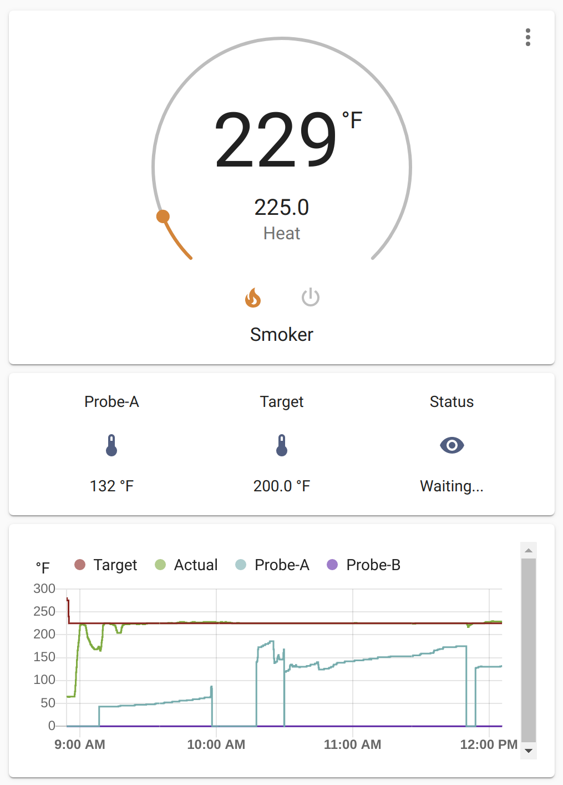
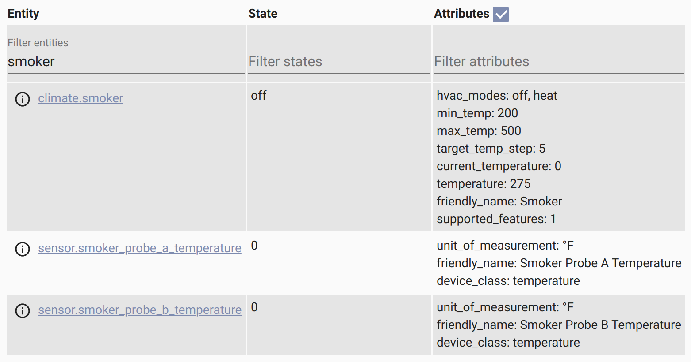
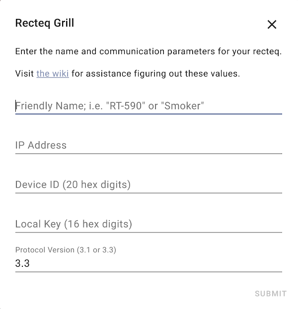

# Home Assistant Recteq Integration

Custom integration for [recteq][recteq] grills and smokers providing a climate
entity to control the unit and sensor entities for the probes.

[](https://github.com/custom-components/hacs)
[](https://github.com/pdugas/recteq/issues)
[](https://github.com/pdugas/recteq/issues)
[](https://github.com/pdugas/recteq/releases/latest)
[](https://github.com/pdugas/recteq/commit/main)
[](https://github.com/pdugas/recteq/blob/main/LICENSE)
[](https://github.com/pdugas/recteq/commits/main)

> **NOTE** - This isn't supported or approved by [recteq][recteq] at all!





## Installation

Download a copy of the [latest release][latest] and unpack the contents into 
into `config/custom_components/recteq/` on your HA machine then restart it.

## Configuration

This integration is configured using the UI only. Navigate to Configuration >
Integrations and tap the red "+" button in the bottom right. Search for and
select the "Rectec" entry. You'll get the dialog shown below. Enter the
details for your grill and tap "Submit".



## IP Address, Device ID & Local Key

The IP address if your grill can usually be found if you dig into the logs
for your DHCP server. Poke around on your router for that.

The [tuyapower project](https://github.com/jasonacox/tuyapower) can be used to
scan for Tuya devices on your network. The controller in the rectecs is a Tuya
device. The IP address is shows (10.0.0.100 below) is the one you want. The ID
value in the output is the 20-digit device ID needed. The product value in the
output **_is not the local key_**!

```shell
# python -m tuyapower
TuyaPower (Tuya compatible smart plug scanner) [0.0.25] tinytuya [1.0.3]

Scanning on UDP ports 6666 and 6667 for devices (15 retries)...

FOUND Device [Valid payload]: 10.0.0.100
    ID = 00000000000000000000, product = XXXXXXXXXXXXXXXX, Version = 3.3
    Device Key required to poll for stats

Scan Complete!  Found 1 devices.
```

[tuyapower](https://github.com/jasonacox/tuya) has some notes on how to get
the local key but I found it on my Android phone pretty simply. I connect it
via USB to my laptop, allow MTP access, then I can browse the filesystem on
the phone. I found `Phone/Android/data/com.ym.rectecgrill/cache/1.abj` has
logs from the app and includes JSON-formatted messages that include a 
`localKey` property. That's the 16-digit local key value needed here.

## Change Log

* 0.0.1 
  * Initial release candidate
  * Works for me. Looking for others to test.

## License

Copyright (c) 2020 Paul Dugas

See [LICENSE](LICENSE) for details.

## Support

Submit [issues](https://github.com/pdugas/recteq/issues) for defects, feature
requests or questions. I'll try to help as I can.

## Credits

I'm Paul Dugas, <paul@dugas.cc>. This is my first HA integration so be gentle!

I learned this was possible from [`SDNick484/rectec_status`][rectec_status] and
based the intial versions of the project on his examples. Much thanks to
[SDNick](https://github.com/SDNick484/) along with those he credits;
[codetheweb](https://github.com/codetheweb/),
[clach04](https://github.com/clach04),
[blackrozes](https://github.com/blackrozes),
[jepsonrob](https://github.com/jepsonrob), and all the other contributors on
tuyapi and python-tuya who have made communicating to Tuya devices possible
with open source code.

[recteq]: https://www.recteq.com/
[latest]: https://github.com/pdugas/recteq/releases/latest
[rectec_status]: https://github.com/SDNick484/rectec_status
